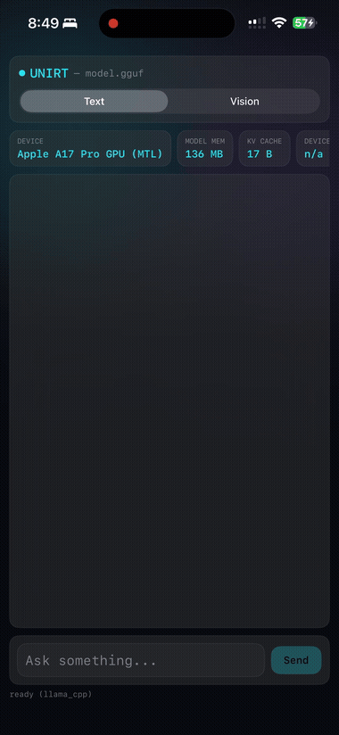

# UniRT SDK

Prebuilt, install-only distribution of **UniRT** — an on-device LLM/VLM/
embedding inference SDK. This repo ships the public C header, the
language bindings (Python / Android / iOS), and prebuilt native
libraries per [Release](../../releases).


The GIF above is `unirt.server` (the bundled OpenAI-compatible server) plus
[examples/chat.html](examples/chat.html), a static test page, hitting a real
LFM2-VL-450M VLM end-to-end on Metal: a two-turn text conversation (the
second question relies on context from the first), then an image dragged
into the page and described by the model. Open the file directly (or serve
it with `python3 -m http.server`) and point it at any `unirt.server`
instance via the URL field at the top.

Pick your platform:

## Python

```sh
pip install unirt          # macOS arm64 wheel, native libraries included
unirt chat bartowski/SmolLM2-135M-Instruct-GGUF   # one-line interactive chat
```

```python
from unirt.auto import AutoModelForCausalLM

model = AutoModelForCausalLM.from_pretrained("bartowski/SmolLM2-135M-Instruct-GGUF",
                                              device_map="llama_cpp")
print(model.generate("The capital of France is"))
```

Or run the bundled OpenAI-compatible server and point any OpenAI client
(or [examples/chat.html](examples/chat.html)) at it:

```sh
python3 -m unirt.server --model bartowski/SmolLM2-135M-Instruct-GGUF \
  --backend llama_cpp --port 8080
```

See [python/README.md](python/README.md) for the full API.

## Android

Easiest: JitPack (the AAR from the matching Release, served as a Maven
artifact — no manual download):

```kotlin
// settings.gradle.kts
dependencyResolutionManagement {
    repositories { maven("https://jitpack.io") }
}
// app/build.gradle.kts
dependencies {
    implementation("com.github.SesameH:unirt-sdk:v0.2.0")
}
```

Or download the AAR from the latest [Release](../../releases) and drop it
into your app, or build it yourself:

```sh
cd android
./gradlew assembleRelease   # needs prebuilt/<abi>/*.so from a Release first —
                             # see android/README.md
```

See [android/README.md](android/README.md).

[examples/android/UniRTChatExample](examples/android/UniRTChatExample) is a
full Jetpack Compose app (Text/Vision mode switch, streaming replies,
per-generation stats), the Android counterpart of the iOS example below —
see its own README for build/emulator instructions.


## iOS

Clone the matching tag, download `unirt-ios-xcframework.zip` from its
[Release](../../releases), unzip it into `ios/`, then add that `ios`
directory as a **local** Swift package dependency. The v0.2.0 tag does not
contain the binary, so adding only the remote repository URL is not enough.
See [ios/README.md](ios/README.md) for exact commands and Xcode steps.

[examples/ios/UniRTChatExample](examples/ios/UniRTChatExample) is a full
SwiftUI app (Text/Vision mode switch, real on-device Metal inference,
verified end to end on an iPhone) — see its own README for build/run/real-
device signing instructions.



## What's closed-source, what isn't

The public C ABI (`include/unirt.h`) and every language binding
(`python/`, `android/`, `ios/`) are ordinary open wrapper code — read
them, fork them, file issues against them. What's not in this repo: the
C++ bridge that implements `unirt.h`, the backend plugins (llama.cpp /
MLX / ONNX Runtime integration), and the build system that produces the
native libraries these bindings link against. Those ship only as
compiled binaries, attached to each [Release](../../releases).

## License

BSD-3-Clause — see [LICENSE](LICENSE) and [NOTICE](NOTICE).
