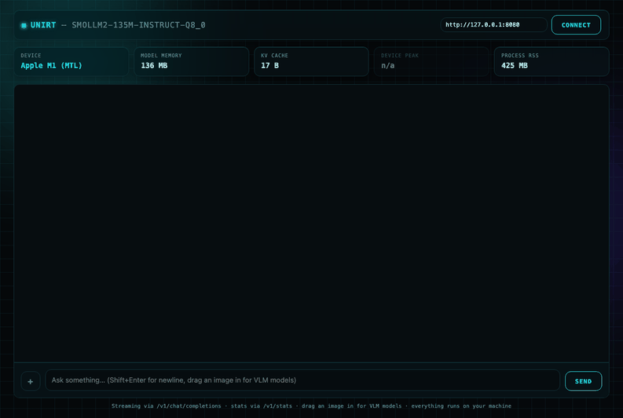

# UniRT SDK

Prebuilt, install-only distribution of **UniRT** — an on-device LLM/VLM/
embedding inference SDK. This repo ships the public C header, the
language bindings (Python / Android / iOS), and prebuilt native
libraries per [Release](../../releases); it does not contain the SDK's
implementation (C++ bridge, backend plugins, third-party engines), which
lives in a private repo.



The GIF above is `unirt.server` (the bundled OpenAI-compatible server) plus
a static test page, hitting a real local model end-to-end. The page itself
lives in the core dev repo (`examples/chat.html`) rather than here, since
this repo only ships install artifacts — point it at any `unirt.server`
instance via the URL field at the top.

Pick your platform:

## Python

```sh
pip install unirt  # once published to PyPI — for now, download the wheel
                    # from the latest Release and `pip install` it directly
```

```python
from unirt.auto import AutoModelForCausalLM

model = AutoModelForCausalLM.from_pretrained("bartowski/SmolLM2-135M-Instruct-GGUF",
                                              device_map="llama_cpp")
print(model.generate("The capital of France is"))
```

See [python/README.md](python/README.md) for the full API.

## Android

Download the AAR from the latest [Release](../../releases) and drop it
into your app, or build it yourself:

```sh
cd android
./gradlew assembleRelease   # needs prebuilt/<abi>/*.so from a Release first —
                             # see android/README.md
```

See [android/README.md](android/README.md).

## iOS

Add this repo as a local or remote Swift package dependency once
`UniRT.xcframework` (downloaded from the latest [Release](../../releases))
is placed at the repo root — see [ios/README.md](ios/README.md).

## What's closed-source, what isn't

The public C ABI (`include/unirt.h`) and every language binding
(`python/`, `android/`, `ios/`) are ordinary open wrapper code — read
them, fork them, file issues against them. What's not in this repo: the
C++ bridge that implements `unirt.h`, the backend plugins (llama.cpp /
MLX / ONNX Runtime integration), and the build system that produces the
native libraries these bindings link against. Those ship only as
compiled binaries, attached to each [Release](../../releases).

## License

BSD-3-Clause — see [LICENSE](LICENSE) and [NOTICE](NOTICE).
