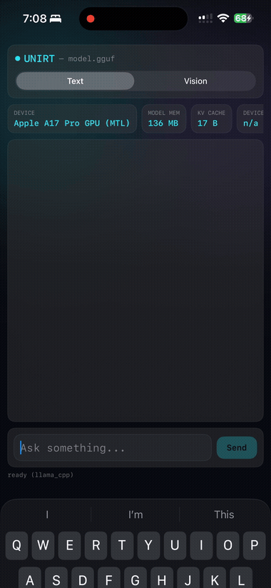

# UniRT Chat (iOS example)

A SwiftUI app that loads a GGUF model with `UniRTKit` and runs a streaming
chat loop, entirely on-device — one app, a segmented **Text / Vision**
switch at the top toggles between an `LlmSession` (SmolLM2) and a
`VlmSession` (LFM2-VL-450M) loaded from bundled resources. Verified end to
end on a real iPhone (A17 Pro): model load, greedy generation, a real reply
mentioning "Paris" for "What is the capital of France?" in Text mode, and a
real description of the bundled `test-photo.jpg` (a synthetic red-house/
green-field/mountain/sun scene) in Vision mode — both confirmed running on
the actual Metal GPU (`device_name` reports `... (MTL)`, not `(CPU)`).



(Recorded via Control Center screen recording on the actual device — not the
Simulator, whose Metal path is too unreliable for real inference, see below.)

The project itself is generated by [XcodeGen](https://github.com/yonaskolb/XcodeGen)
from `project.yml` — the `.xcodeproj` is not checked in.

## Build & run

```sh
brew install xcodegen

# bundle test resources (any GGUF works; these are just small, easy defaults)
curl -L -o Resources/model.gguf \
  "https://huggingface.co/bartowski/SmolLM2-135M-Instruct-GGUF/resolve/main/SmolLM2-135M-Instruct-Q8_0.gguf"
curl -L -o Resources/vlm-model.gguf \
  "https://huggingface.co/runanywhere/LFM2-VL-450M-GGUF/resolve/main/LFM2-VL-450M-Q4_0.gguf"
curl -L -o Resources/mmproj.gguf \
  "https://huggingface.co/runanywhere/LFM2-VL-450M-GGUF/resolve/main/mmproj-LFM2-VL-450M-Q8_0.gguf"
# test-photo.jpg is already checked in (a small synthetic scene for the VLM test)

xcodegen generate
open UniRTChatExample.xcodeproj   # or drive it headlessly, see below
```

In Xcode: select the `UniRTChatExample` scheme, pick a simulator (or a
real device — see "Real device" below), and Run.

Headless (simulator), from the command line:

```sh
xcodebuild -project UniRTChatExample.xcodeproj -scheme UniRTChatExample \
  -destination "platform=iOS Simulator,name=iPhone 16 Pro" build

xcrun simctl boot "iPhone 16 Pro"   # if not already booted
xcrun simctl install booted .../Build/Products/Debug-iphonesimulator/UniRTChatExample.app
xcrun simctl launch booted com.peterhuang.unirt.UniRTChatExample
```

Note: Metal in the iOS **Simulator** is known to be slow/unreliable for
real inference (a run there can take 80s+ and time out) — the Simulator is
fine for a build/UI smoke test, but treat the real device as the source of
truth for anything performance-related.

## Real device

The scheme also targets any connected iPhone. Deploying there needs a
signing team — a free "Personal Team" works, no paid Apple Developer account
needed:

1. Xcode → Settings → Apple Accounts → add your Apple ID. It'll show a
   "Personal Team". Click "Manage Certificates…" → "+" → "Apple Development"
   to generate a signing certificate (one-time).
2. Get your Team ID (the cert's `OU` field):
   ```sh
   security find-certificate -c "Apple Development" -p login.keychain-db | \
     openssl x509 -noout -subject
   ```
3. `export DEVELOPMENT_TEAM=<your team id>` before `xcodegen generate` —
   `project.yml` reads it via `${DEVELOPMENT_TEAM}`, so it never needs to be
   committed.
4. Build + install + launch:
   ```sh
   xcodebuild -project UniRTChatExample.xcodeproj -scheme UniRTChatExample \
     -destination "platform=iOS,name=<your iPhone>" -allowProvisioningUpdates build

   xcrun devicectl device install app --device <device-id> \
     .../Build/Products/Debug-iphoneos/UniRTChatExample.app
   xcrun devicectl device process launch --device <device-id> \
     com.peterhuang.unirt.UniRTChatExample
   ```
5. First launch fails with "invalid code signature... profile has not been
   explicitly trusted" — on the phone: Settings → General → VPN & Device
   Management → trust the developer profile, then launch again.

A **free developer profile allows at most 3 apps installed on a device at
once** (this counts the `xctest` runner XCUITest installs alongside the app
itself, so a single UI test run typically uses 2 of the 3 slots). Hitting
the cap shows up as "This device has reached the maximum number of
installed apps using a free developer profile" during `xcodebuild test`.
Free a slot with:
```sh
xcrun devicectl device uninstall app --device <device-id> <bundle-id>
```
Installing/uninstalling apps mid-recording can also interrupt an active
Control Center screen recording (a springboard-level "Verifying App…"
overlay appears) — clear unrelated dev apps *before* starting a recording,
not during.

## How it works

`ChatViewModel` holds two possible sessions — an `LlmSession` and a
`VlmSession`, both wrapping the same statically-linked llama_cpp plugin
(`UniRT.registerStaticPlugin` once at startup; iOS forbids `dlopen` of
arbitrary paths). The first time the segmented picker switches to a mode,
it opens that mode's session from its bundled GGUF, mirroring the iOS
binding's own README usage snippets for both `createLlmSession` and
`createVlmSession`; after that, both sessions stay resident and switching
back and forth is instant — reloading a ~300MB VLM model on every toggle
was enough of a momentary memory spike to make iOS reclaim memory from (and
kill) an active Control Center screen recording. Vision mode's "+" button
attaches the bundled
`test-photo.jpg` (a stand-in for real drag-and-drop, which iOS doesn't
support the same way the web test page does) before `send()` passes it
through `VlmGenerateOptions.imagePaths`.

`UniRTChatExampleUITests/ChatUITests.swift` drives the real UI for both
modes — types a question, taps Send, waits for a reply mentioning Paris in
Text mode; switches to Vision, attaches the test image, and waits for a
reply describing it — the same check used to verify this example actually
works, not just compiles:

```sh
xcodebuild test -project UniRTChatExample.xcodeproj -scheme UniRTChatExample \
  -destination "platform=iOS Simulator,name=iPhone 16 Pro"

# or, on a signed/trusted real device (see "Real device" above):
xcodebuild test -project UniRTChatExample.xcodeproj -scheme UniRTChatExample \
  -destination "platform=iOS,name=<your iPhone>" -allowProvisioningUpdates
```
